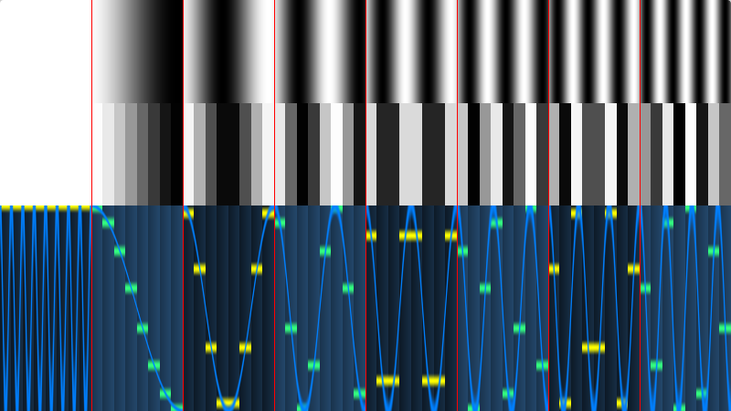

# 1D DCT Basis Image Visualization

# Demo

* https://www.shadertoy.com/view/XdffWl

# Pictures

* 

# Description

INSTRUCTIONS: Click on column to zoom; drag mouse up/down to turn grid lines on/off.

NOTE: Technically the 1D DCT, u = 0, has a frequency of 0, but it is shown here as 8 since a straight line is visually boring.

# Tags

fft, 1d, discrete, dct, visualization

